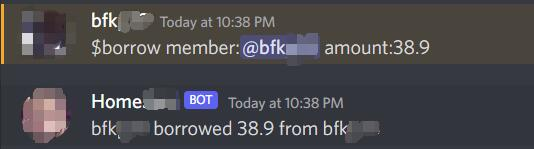

# Discord Financial Bot
- Deploied in you discord server that can help you and your roommates or friends to record the bills
- It also provids personal view so to check your financial relationship to others in the same server.
### For deploying MariaDB on your server, find other resources.

# Use it first time?
After you have deploied your own **MariaDB** server, you can use command `init` at any channel you want, to add all members in your guild to the database. 

# How to record transactions
So far, only `borrow` and `lend` two actions, plus `amount` can be registered into database. You should add `$` before any command. You don't need to refer to yourself, but only to the other person.

`$borrow member:@<other person> amount:<how much you borrow>`
 
`$lend member:@<other person> amount:<how much you borrow>`

### Example
borrow $30.2 from memberA:
`$borrow member:@memberA amount:30.2`

# How to view histroy
As so far only "borrow" and "lend" can be registered, you can view histroy based on them respectively plus a selected member, or view the detailed histroy.

`$histroy (action:<lend | borrow>) (member:<member>)`

### Example
- Full history
`$histroy`

- To see how much money lend to memberB
`$histroy action:lend member:@memberB`

- To see history related to memberB
`$histroy member:@memberB`

## Road map
- [x] Basic database and query.
- [x] Channel and according responses.
- [ ] Create repayment method that can track orders easily.
- [ ] Manage orders on a web page.
